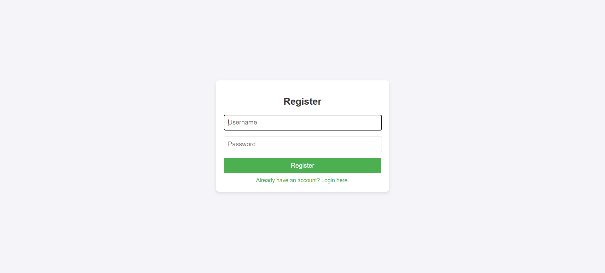
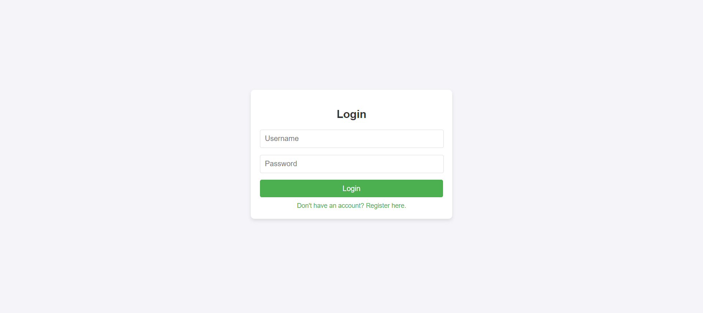

# Keystroke Dynamics Web Authenticator (PHP + JS)

A secure user authentication system that leverages **Keystroke Dynamics**—a behavioral biometric based on typing rhythm—to verify identities during login and registration. Implemented using PHP and vanilla JavaScript for browser-side timing capture.

---

## Problem Statement
Traditional username-password systems are vulnerable to brute-force attacks and data leaks. Keystroke dynamics adds a biometric verification layer to increase security without additional hardware.

---

## Relation to Design and Analysis of Algorithms (DAA)
- **Similarity Measurement**: The algorithm calculates average absolute differences between timing vectors, optimized with `O(n)` traversal.
- **Threshold-Based Classification**: Simple and efficient, allowing real-time decisions.
- **DAA Topics Applied**:
  - Greedy strategy for nearest-match classification.
  - Time complexity and performance optimization.

---

## Time and Space Complexity
| Operation                  | Time Complexity | Space Complexity |
|---------------------------|------------------|------------------|
| Typing data capture (JS)  | O(n)             | O(n)             |
| Difference calculation    | O(n)             | O(n)             |
| PHP file parsing          | O(m * n)         | O(m * n)         |

> Where `n` is the number of keystrokes, and `m` is the number of users.

---

## Installation & Run
1. Install XAMPP or any local server with PHP.
2. Copy files into `htdocs/keystroke-auth`.
3. Start Apache and open: `http://localhost/keystroke-auth/register.html`
4. Register, then test with `login.html`.

---

## Sample Output (from `auth.php`)
```
Hold Difference: 15.2
DD Difference: 19.7
UD Difference: 10.4
Total Difference: 15.1
Authentication Successful!
```
---

## User Interfaces

### Register Page  


### Login Page  


---

## Real-World Applications
- **Cybersecurity**: Used in high-security portals for continuous user verification.
- **Banking/Finance**: Adds an invisible layer of authentication.
- **Workplace Systems**: Prevents unauthorized access even if credentials are stolen.

---

## Cybersecurity Impact
- **Difficult to spoof**: Unlike passwords, keystroke behavior is hard to mimic.
- **No extra hardware**: Behavior-based biometric.
- **Challenge for Hackers**:
  - High entropy of behavioral data.
  - Time-sensitive precision needed to bypass the system.

---

## Advantages
- Lightweight, works in-browser.
- Easy integration into existing PHP projects.
- Transparent to users.
- Boosts password system without extra effort.

---

## License

MIT License.

---


## Developed by

Karthik B  
